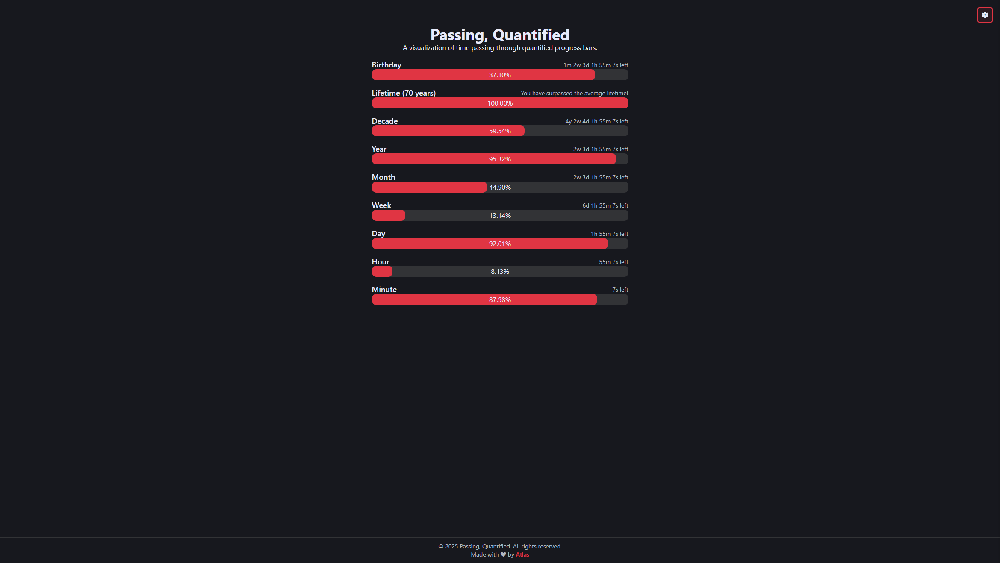

# Passing, Quantified ⏱️

A beautiful, real-time visualization of time passing through interactive progress bars. Watch as seconds, minutes, hours, days, weeks, months, years, and even your lifetime tick away—quantified and visualized in an elegant web interface.


## ✨ Features

- **Real-time Progress Tracking**: Updates every 100ms for smooth, live visualization
- **Multiple Time Scales**: Track progress across:
  - Minutes
  - Hours
  - Days
  - Weeks
  - Months
  - Years
  - Decades
  - Lifetime (based on 70-year life expectancy)
  - Birthday countdown
- **Personalization**: Set your birthday to:
  - Track time until your next birthday
  - Calculate your lifetime progress
  - Get a special birthday greeting on your special day! 🎉
- **Persistent Settings**: Your birthday is saved in local storage
- **Clean UI**: Modern, minimal design with a responsive layout
- **Time Remaining Display**: See exactly how much time is left in each period
- **Percentage Display**: Visual progress bars with precise percentage indicators

## 🚀 Demo

The live demo is available [here](https://atlas7005.github.io/passingQuantified/).

## 📸 Screenshot



## 🛠️ Installation

1. **Clone the repository**:
   ```bash
   git clone https://github.com/Atlas7005/passingQuantified.git
   cd passingQuantified
   ```

2. **Open in browser**:
   - Simply open `index.html` in your web browser
   - No build process or dependencies required!

## 📖 Usage

### Setting Your Birthday

1. Click the ⚙️ settings icon in the top-right corner
2. Select your birthday from the date picker
3. Click "Apply Settings"
4. Watch as your birthday countdown and lifetime progress bars update!

### Understanding the Progress Bars

Each progress bar shows:
- **Title**: The time period being tracked
- **Time Left**: Remaining time in that period (e.g., "2d 5h 30m 15s left")
- **Progress Bar**: Visual representation of elapsed time
- **Percentage**: Exact completion percentage

## 🎨 Customization

The project uses CSS variables for easy theming. Modify `css/global.css` to customize:
- Colors (`--primary-color`, `--background-color`, `--text-color`)
- Border styles
- Font sizes
- Spacing

## 📁 Project Structure

```
timeProgressBars/
├── index.html          # Main HTML file
├── css/
│   ├── global.css      # Global styles and CSS variables
│   └── index.css       # Component-specific styles
├── js/
│   └── index.js        # Core logic for time calculations and updates
└── README.md           # This file
```

## 🔧 How It Works

1. **Time Calculation**: The JavaScript calculates the start and end times for each period (minute, hour, day, etc.)
2. **Progress Computation**: Elapsed time is divided by total duration to get percentage
3. **Real-time Updates**: A `setInterval` runs every 100ms to update all progress bars
4. **Local Storage**: Birthday data is persisted using browser's localStorage API
5. **Dynamic Rendering**: Progress bars and time remaining text update smoothly in real-time

## 🌐 Browser Compatibility

Works on all modern browsers:
- ✅ Chrome/Edge (latest)
- ✅ Firefox (latest)
- ✅ Safari (latest)
- ✅ Opera (latest)

## 🤝 Contributing

Contributions are welcome! Feel free to:
1. Fork the repository
2. Create a feature branch (`git checkout -b feature/AmazingFeature`)
3. Commit your changes (`git commit -m 'Add some AmazingFeature'`)
4. Push to the branch (`git push origin feature/AmazingFeature`)
5. Open a Pull Request

## 💡 Future Ideas

- [ ] Dark/Light theme toggle
- [ ] Custom life expectancy setting
- [ ] Share progress snapshots
- [ ] Multiple birthday tracking
- [ ] Custom time periods
- [ ] Sound notifications

## 📄 License

This project is open source and available under the [GNU Affero General Public License v3.0 or later (AGPL-3.0-or-later)](LICENSE).

## 👤 Author

**Atlas7005**
- GitHub: [@Atlas7005](https://github.com/Atlas7005)
- Repository: [passingQuantified](https://github.com/Atlas7005/passingQuantified)

## 🙏 Acknowledgments

- Font Awesome for icons
- Inspired by the desire to visualize and appreciate the passage of time

---

**Remember**: Time is the most valuable resource we have. Use it wisely! ⏰
